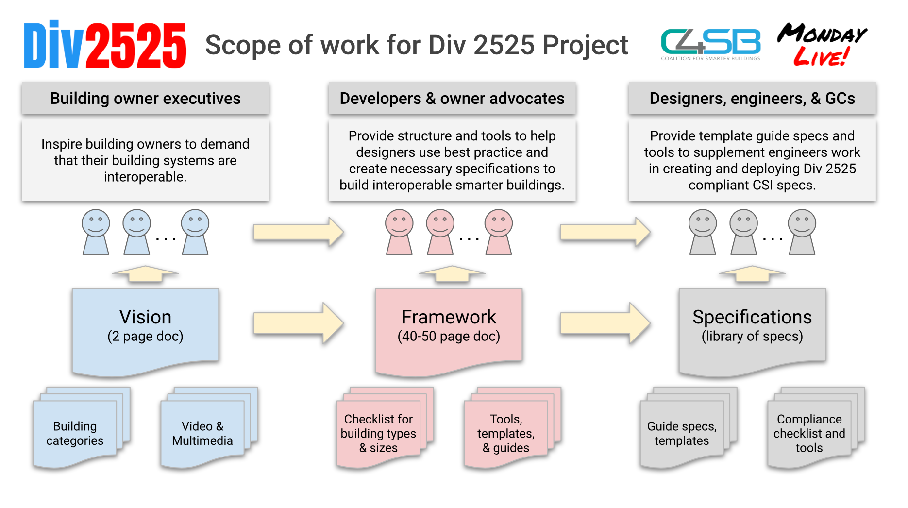
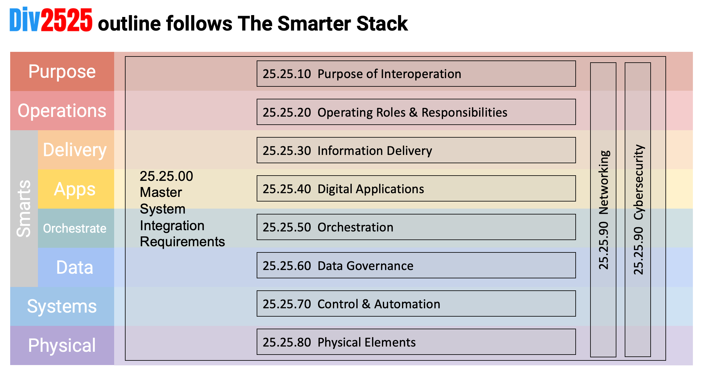

# Introduction

This Framework outlines the purpose and operational requirements for enabling data and operational interoperability in Smarter Buildings.

## What is a Smarter Building?
For our purposes, a building can be called "smarter" if its building systems' data are interoperable and interconnected, to enable monitoring, verification, operation, and control, using a unified data architecture where data from one system can be exchanged with other systems as well as higher level business applications, services, and tools. Simply put, Smarter Buildings enable buildings to provide greater comfort and productivity for occupants, greater visibility and control for the operations and management teams, and lower costs, better business outcomes, and higher value for owners. Division 25.25 is a part of the project specification process that can be used to describe how to facilitate the collecting, exchange, and use, over time, of data across multiple building systems, enabling owners to make their buildings smarter and achieve goals such as sustainability, lower total cost of ownership, higher operational efficiency, and a better user experience.

Owners and operators of buildings, whether building, retrofitting, or operating them, should consider these requirements and incorporate them into their building's design, construction, and operations. Getting the most out of your "smarter" buildings can be complicated, but being proactive as early as possible (ideally when you start to imagine your next project) maximizes the potential value while keeping the costs of doing so as low as possible. Following this guide can help organize and inform your team so that you get what you, your operators, and your occupants want/need, you reduce confusion and change orders, and you end up future-ready for unknown things to come.

## Intro.1    Intended Use & Audience

This Framework document is intended to be used by two groups: Owners and operators who want smarter buildings and need a way to specify what to ask for (the demand side of the market for smarter buildings). This group, who want to describe the design intent of their smarter building project, can use and adapt the DIV 25.25 Framework for their specific project, as the basis for an Owner's Project Requirements (OPR), Owner's Design Requirements (ODR) or Basis of Design document, which can be given to specifying engineers, contractors, and vendors who will be designing and bidding on or providing the necessary products and services.

> **Expert Tip:** Create an Owner's Project Requirements document to describe the design intent of your smarter building project. The OPR informs the formal project specifications, and provides valuable context for all vendors on what the desired outcome of the project needs to be.

Smarter building vendors, contractors, and service providers who need a way to describe what they offer in terms that their buyers will recognize as what they want (the supply side of the market for smarter buildings). This includes system integrators, trade and general contractors, and suppliers of physical and digital products and services to the building industry.

> **Expert Tip:** For suppliers: Create an Our Offering on the Smarter Stack document to illustrate and describe what your firm offers in the context of how an overall smarter building solution would work. Describe the parts that you provide, so it is clear what comes from you and what will need to come from others. Your offerings may cover all layers in a vertical stack, for a specific market or type of solution, or your offerings may focus on specific layers of the stack and be transferable to multiple markets/uses.

## Intro.2    Why Div2525?

The construction industry in the United States generally follows a guideline for project documents from the Construction Specification Institute (CSI) which organizes the various trades of a project into specific divisions of responsibility (and a numbering system) called CSI MasterFormat (www.csiresources.org). CSI MasterFormat provides a foundation for defining project design, specification, and contracting responsibilities. Consulting engineers writing project specifications develop the required documents following the CSI MasterFormat numbering outline, helping vendors bid on work aligned with their firm's expertise. For example, Plumbing is Division 22, HVAC is Division 23, Electrical is Division 26, etc. Division 25 is part of the CSI Master Format and as of 2023 is called "Integrated Automation." It includes details for how all of the building's systems are to be integrated into a common building management system (BMS), data set requirements or "Points Lists," database development, site nomenclature, supervisory and programmable controls hardware and software, the operator user interface or "front end," and the building control system interface to "other services." These other services include both on premises and (Internet) cloud-based tools and applications such as analytics applications, reporting, energy management, remote monitoring, asset management, work order processing, alarming and alerting, and much more.

Division 25.25 Master System Interoperation Requirements

The work of this group proposes designating a section of Division 25, to be called Division 25.25 Master System Interoperation Requirements, to specify details about system and data interoperability. This includes interfaces between the various supporting tools and applications, the actual control network (often called OT for Operational Technologies), and the building IT (Information Technologies) network (if there is one). The proposed Division 25.25 section would be organized following the "Smarter Stack" (described below) to identify specific subsections and their associated interoperability and design requirements.

## Intro.3    Who should be in charge? Division 25 Contractors and the MSI Role

Smart building Division 25 contracts are typically bid on by Controls Contractors, System Integrators, and, more commonly today, Master Systems Integrators (MSIs), whose knowledge and expertise span the many disciplines required for complex building integration. There is an increasing convergence of control networks in the building systems operational technology (OT) domain with the informational technology (IT) domain, so Division 25 contractors must be well versed in IT technology, systems, and practices. Furthermore, Division 25 contractors must have extensive knowledge of data, data systems, communications, cybersecurity, and related fields. For the purposes of this document, we use "MSI" to mean the party responsible for the whole smarter building solution. The MSI may be an outside contractor, or a role filled by someone in the owner's organization.

> **Expert Tip:** For Owners/Project Managers: create a Contractor's Project Responsibilities Matrix to organize the areas of responsibility for each vendor during project construction/delivery, making clear which deliverables should come from which supplier, where there are shared responsibilities, and who has oversight and approval.

> **Expert Tip:** For Owners/Operators: create an Operational Responsibilities Matrix to organize the areas of responsibility for each operational role (including internal staff and external vendors) once the building is operational, making clear which deliverables should be done by which role, where there are shared responsibilities, and who has oversight and approval.

## Intro.4    How does this Framework fit with other resources?

The Coalition for Smarter Buildings is developing a series of resources for owners, operators, and occupants of buildings to better understand, implement, and enjoy the benefits of smarter building solutions.

*Figure 1. Smarter Building Resources from the Coalition for Smarter Buildings*

### Intro.4.1 Div2525 Vision

The Div2525 Vision document (link below) lays out for building owners and developers the reasons why making building data interoperable can make buildings, and the occupants' experience in them, more valuable by improving occupant well-being, safety, and convenience, while reducing labor, energy costs, and greenhouse gas emissions, harnessing renewable energy sources, and managing cybersecurity risks. [https://vision.div2525.org]

### Intro.4.2 Div2525 Framework

This Div2525 Framework document (this document) outlines for owners, their project managers and design consultants, the design principles necessary for connecting buildings and their systems in a unified way and at an affordable price. For each topic area, the Framework poses questions to consider in order to make the design intent of the project clear. [https://framework.div2525.org]

### Intro.4.3 Division 25.25 Specifications

The Coalition is developing resources for Division 25.25 Specifications, which include templates and examples for smarter buildings with different goals, uses, systems and complexity as well as additional resources from standards bodies and industry. The specifications are what contractors and vendors would comply with when bidding on and executing a specific project. Resources provided here could be used as a generalized spec, or more likely would need to be adapted by the owner's project manager or design professionals to the specific situation of a building or project.

## Intro.5    Applicable to All Building Types and Sizes and Portfolios

The principles outlined in this Framework are intended to be beneficial for connecting data for all buildings, regardless of their scale, quantity, intended use, or complexity.

### Intro.5.1 Single or Multiple Buildings

Making data interoperable can help increase the efficiency of a single building, and can greatly increase efficiency when implemented across a portfolio of buildings. For example, integrating multiple subsystems such as HVAC, lighting, security, energy-and power-metering, within a single building provides the owner with greater efficiencies for operational staff such as a unified user interface for monitoring and alarming of the building. It may also provide secure remote access for small, unstaffed buildings and access for service providers that provide 24/7 monitoring services.

### Intro.5.2 Small and Large Buildings & Projects

Owners/operators of smaller buildings, simpler systems, or with limited project budgets will likely use a limited number of integrated systems, but installing interoperable systems will allow greater future flexibility even if Day One integrations are minimal. By adopting this method and implementing interoperable systems consistent with this framework the value of the data and the building(s) can greatly multiply, especially in the future as more systems are interconnected. Owners/ operators of larger or more complex buildings who want to maximize the value of interoperable data will benefit from following the framework to connect most or all of their building systems and data, making information from one system useful to all others.

### Intro.5.3 Various Building Types

Different building types have different systems that are important to their operation and occupant experience, so the exact list of systems that will be valuable to connect will vary. But no matter which or how many systems are connected, it is important to have a common way of connecting, communicating, storing, sharing, and using data across all systems. The Div2525 specification is anticipated to be adopted mostly by commercial and institutional building owners and specifiers (not single-family residential or industrial), including owner-occupied buildings, campuses, multi-tenant (usually 4+ units) residential properties, and mixed-use facilities. The foundation of integrated automation for building controls has its roots in the industrial sector, however industrial facilities such as manufacturing plants typically require significant process and facility integration, and much tighter regulatory and code requirements, which is beyond the scope covered in this framework.

## Intro.6    Fundamentals of Integration: Be Inter-Connected

When starting down the path of making your buildings smarter, a foundational step is digitally connecting all the required equipment, devices, and spaces so that your users can see and interact with the information they need to do their jobs or have the occupant experience they expect.

### Intro.6.1 Access Onsite and Remotely

Buildings are inherently physical, and much of their data is associated with location-based sensors, actuators, and specific pieces of equipment (occupancy, temperature, pressure, flow, alarm, etc.). But access to the data doesn't have to be location-specific. Making data from systems interoperable within a building (or campus/ portfolio) enables unified management, whether accessed just onsite or remotely, and whether accessed for a single building or aggregated across a campus or portfolio of buildings. Today, most users of smarter building data expect access via a connected mobile or desktop device. In most cases, connecting data to user devices and applications is done via the Internet (often referred to as "the cloud"), which allows users to see and interact with the building both onsite and remotely, so the location of the user doesn't matter. But in some buildings, due to the owner's policy or for security reasons, data access is limited to users with devices connected directly to the onsite data network or, for campuses, connected via a private, dedicated network, such using a VPN (Virtual Private Network.)* *Note: This document assumes that the building(s) has/have an existing IT infrastructure (data network) that is supported by the owner. In most cases, this is an Ethernet IP-based, Internet-connected data network. See Section 25.25.90.

### Intro.6.2 Converging Operational Technology (OT) and Information Technology (IT)

Smarter Buildings require that all controls equipment and their data are on a common network where data can be exchanged. Having open and managed data exchange between systems is often the biggest challenge in the creation of a smarter digital building. Well managed and secure data exchange between systems via Internet protocol (IP)-based OT and IT networks is fundamental for a smarter digital building. In most projects, enabling systems to have interoperability is very challenging because of the historical lack of convergence between OT and IT systems. Simply put, building systems have, until recently, been stand-alone, operated on proprietary or air-gapped networks and thus unable to share data. As a result, interoperability was not achievable as information could be exchanged on a common IT local area network (LAN). In many cases the building owner does not even have an IT department and, for leased space facilities, tenants each have their own networks in their respective spaces which are not connected to the landlord's network or each other. Overcoming this challenge and determining the most appropriate network topology and provisioning is typically the hardest task in realizing these goals. Section 25.25.90 - Networking provides an overview of different network topology architectures for consideration. Determining, and having stakeholders agree to, the chosen topology architecture allows all of the other requirements to fall into place.

## Intro.7      The Future: Cloud-Native Buildings

Enterprises, large and small, are increasingly adopting cloud computing as the core architecture for their ERP, CRM, supply chain, and other business functions. Our personal lives have also been impacted, as the smartphones and smart devices we use today highly rely on the cloud. These parallel, and related, transformations have brought more of our physical world into the digital realm, and accelerated the creation and imagining of new value, convenience, and efficiencies. Through the 2000s and 2010s, what was called "the cloud" evolved from initially providing public cloud-based digital storage (e.g. Dropbox and Flickr) to providing collaborative services (like Salesforce, NetSuite, and DocuSign) to today's adoption of multi-layered applications whose pieces often rely hybrid clouds, which are a combination of public cloud resources (AWS, Azure, GCP, etc.) and private clouds (owned and operated by enterprises), located both on- and off-premises. Underpinning this evolution is a growing set of technologies and architectures commonly referred to as "cloud-native." The essence of the cloud-native approach is that systems are built to be run in the cloud (whether or not they are always deployed in the cloud), in order to provide the scalability, security, reliability, and flexibility that the vastness of the cloud provides. To help promote this opportunity-opening, digital architecture, the Linux Foundation, champions of open-source IT solutions, created the Cloud Native Computing Foundation (CNCF), whose mission is "to make cloud native ubiquitous." CNCF hosts projects that develop open-source components used by developers and integrators globally. The CNCF has established a set of cloud-native principles that guide and define how to build and operate cloud-native digital applications. It is against this backdrop that the DIV2525 authors are currently envisioning how cloud-native will impact commercial buildings: that by 2030, the industry norm will be cloud-native buildings -meaning that the data and information systems in them are built, installed, and used using cloud-native principles -- providing security, flexibility, reliability, and connectedness to the building's operations. Because the specifics of how buildings become cloud-native is still evolving, the authors do not feel the topic is mature enough to add to this version of the DIV2525 Framework. A more robust description of the importance of and path towards cloud-native buildings will come with a future revision of this Framework, likely published in 2024/5. In the meantime, the following points should be considered regarding cloud-native when reading this Framework:
- Cloud-native is a way to construct flexible, secure, reliable digital applications. Cloud-native is not as much about the cloud as it is about how the cloud operates. By adopting cloud-native principles, building systems can act as if they were in the cloud, easily interacting as necessary with other cloud-native actors (on-prem or the cloud) securely and flexibly. Cloud-native principles should be considered when reviewing the requirements outlined in section 25.25.00. We also suggest you consider cloud-native when reviewing the Purpose of Interoperation section 25.25.10. Specifically, consider how the systems (and the data they generate or can use) can providing some benefit to the building owner/tenant outside of the obvious functions of environmental control.

Cloud-native should be considered when selecting applications outlined in 25.25.40, as many applications are using containerized technologies that are inherently cloud native. Cloud-native, in many ways, is the core of what drives 25.25.50. By moving towards cloud-native principles, the exchange and orchestration of data becomes more straightforward. Cloud-native, and its inherent ability to facilitate sharing and re-use of data, should also be considered when reviewing Data Governance, as outlined in 25.25.60. Lastly, cloud-native is about networks and deals directly with cybersecurity by providing the tools to enable provide zero-trust at scale, as such cloud-native principles should be considered in 25.25.90 (Networks) and 25.25.95 (Cybersecurity).
- The Interoperable Building Box (IBB)

IBB Interoperable Building Box

Critical to realizing the cloud-native building vision is the need for an open and standardized on-prem way for all of the systems in the building to connect with each other and with cloud resources securely. The C4SB has initiated an open-source project to create the Interoperable Building Box (IBB) that is, in effect, a small cloud-native data center installable in the building either as a physical device or an on-prem VM environment. Integrators and admin users install applications needed for the functions of the building in the IBB of the building, somewhat like the way we install an app on our phones.! The IBB can be seen as a way for applications defined in 25.25.40 to be installed when they need to be on-prem for whatever reason. It's also worth noting that the IBB can be a place to install software for the control systems described in 25.26.70. The IBB can also provide on-prem local storage for applications (as described in 25.25.60) that require such services, which can include caching/buffering of data as required. The IBB should also be seen as part of the network of the building and should, therefore, be considered as part of 25.25.90 and 25.25.95.

## Intro.8    How the Framework Is Organized: The Smarter Stack

The sections of this framework follow those presented by the Coalition for Smarter Buildings and MondayLive! in The Smarter Stack, which outlines the layers of products, services, architecture, policies, and responsibilities necessary to make a building "smarter."

*Figure 2. The Smarter Stack*

This document provides information for each section with guidance on how to apply the requirements. It is important to understand how each section builds upon the others. To effectively use this framework and apply the stack, the project designer must understand and address all of the sections. There are (11) total sections in the stack - (8) "horizontal" sections and (3) cross cutting sections:
- 25.25.00 Master Systems Interoperation Requirements: This cross-cutting section discusses the contractual, technical and project management requirements to deliver a fully integrated smarter building. It usually includes a Contractor's Project Responsibilities Matrix that defines, for the project construction and installation process, who has what responsibilities when it comes to integration of the physical systems with an interoperable data structure, and what the expected Deliverables are.
- 25.25.10 Purpose of Interoperation: Section 25.25.10 lays out the owner's project-specific goals for having interoperable data and a smarter building. It would include foundational information that establishes the project objectives for data integration, interoperability, access, enterprise access, and general technical objectives.
- 25.25.20 Operating Roles & Responsibilities: Section 25.25.20 describes who will use the information presented in the Section 25.25.30 Information Delivery layer, in order to achieve the Section 25.25.10 Purposes identified for the building or project. Section 20 defines who are the user groups (when the building is operating), and what are their needs relative to the building(s). It can include defining personas, process flow charts, user needs, user skill sets, and (for staff) training/career paths.

- 25.25.30 Information Delivery: Section 25.25.30 provides requirements associated with how actionable information is delivered across systems, buildings, and the enterprise from the Section 25.25.40 Applications to the people/roles defined in Section 25.25.20. Section 30 defines the digital devices (such as mobile, wearable, laptop, desktop), user interfaces (UIs), front-facing apps, machine-to-machine (M2M) connections, or other methods that present ways for users to interact with the digital information. This section is also the place to discuss how separate data applications need to work and be presented together to deliver functionality not possible in one application alone.
- 25.25.40 Applications: Section 25.25.40 is about the software applications that use data from the building and external sources to provide actionable information to the user. It lays out how applications are to co-exist within the building environment, and how data is used and retained for use by the applications. Applications may also provide control logic, machine learning, administration of systems, and additional management capabilities. The application layer should provide software developers with the key requirements for developing interoperable applications.
- 25.25.50 Orchestration: Section 25.25.50 relates to directing the movement of data and information between applications, systems, storage, and users. It outlines the technical attributes of common, interoperable system data and how data is exchanged, normalized, and converted within and between applications. Topics include naming conventions, data typing (International System of Units (SI) vs Imperial Units (IU)) and structure, semantic tagging, API requirements including documentation and behavior, and additional details relating to how data moves between applications and data sources.
- 25.25.60 Data Governance: Section 25.25.60 outlines the project's governance (policy) requirements for data ownership, organization, format, context, temporal and spatial structure, naming conventions, storage (hardware and software), database structure, access, continuity, and data security and privacy.
- 25.25.70 Control Systems: Section 25.25.70 defines the control and automation systems that connect to the physical elements listed in section 25.25.80, and that provide "built in" controls and the digital communication bridge to other components of the same system, as well as to other systems, applications, buildings, or entities outside of the portfolio. Topics include data required for meeting sequences of operation, the control automation platform requirements, and how each control system supplies data to higher level applications.
- 25.25.80 Physical Elements: Section 25.25.80 should be used to describe the physical elements of your project/building/portfolio - the actual devices and spaces - that the digital smarter building system will connect to, monitor, control or interact with. This section can also be used to articulate what needs "smarter" functionality and what does not.
- 25.25.90 Networking: Section 25.25.90 is a cross-cutting section, supporting all of the above sections, and addresses the physical means of transporting digital communications for building systems and their associated components. Such a digital network would include the server(s), cabling, routers and other related hardware and software.
- 25.25.95 Cybersecurity: Section 25.25.95 is a cross-cutting section discussing risks, assessment strategies, and design of cybersecurity best practices for OT systems. This section presents basic, moderate, and advanced suggestions for managing cybersecurity risks both at the physical security and the logical security levels for OT building systems along with guidance for working within and alongside IT based infrastructures. The full version of this document provides more detail for each of the DIV 25.25 sections.

End of Introduction
